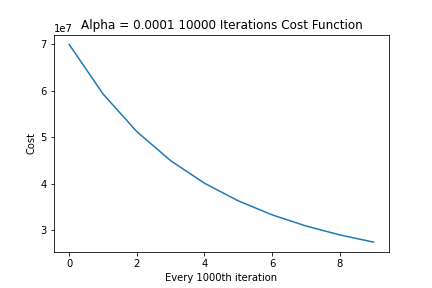

# Crystallum-Credit-Company


#### Team Members
ghh
• Hwa Hara, Fannie Polcari, Dantrell Person, Huda Alghazouli, Kafayat Lawal, Angele Gueupi, William Mills

## Project Summary:

We are a credit card company named Crystallum looking to improve our credit lending processes.

## Kaggle Analysis:

https://public.tableau.com/app/profile/fannie.p/viz/Project4Team1/Dashboard1

https://public.tableau.com/app/profile/fannie.p/viz/CrystallumCreditCardCompanymergeddataframe/DebtStatus_Gender_Income_Education?publish=yes

## Problem Statement:

Analyze current customer metrics to assist credit team and leadership in making data backed decsions on what credit ranges to give newly approved customers, and determine which customers are likely to pay off their credit balance.

## What Business Impact does this have?/ What is the Business Value?

Our analysis will increase Crystallum profits by imroving vetting processes on new credit customers so that more top applicants with a high likelihood of paying back their debt get high credit limits. This also reduces risk by not extending higher credit limits to more risky customers.

## Stakeholders:

Leadership team, credit team, debt collection team, sales team

## Scope (Tools used):

Python, Pandas, Matplotlib, Linear regression, Classification, Logistic Regression, Random Forest Classifier, Tableau, SQL

## Tasks:

1. Pick technology pieces to support the project. (3 or more)
2. Present how we trained a then used machine learning in this real-world scenario that can lead to a Tableau.
3. In Tableau further exampling the use of machine learning by showcasing a few individuals and how that data can be analyzed and relied on for making business decisions for Crystallum

## Data Source:

We selected the following files from the Data Set:
The first dataset consists of 10,127 customers mentioning their age, salary, marital_status, credit card limit, credit card category, etc. There are nearly 18 features.

https://www.kaggle.com/datasets/sakshigoyal7/credit-card-customers

This second dataset consists of 777,715 customers mentioning: Gender,car owner, property owner, Number of children, Annual income, Income category, Education level, Marital status,Way of living, Birthday, Start date of employment, Is there a mobile phone, Is there a work phone, Is there a phone, Is there an email, Occupation, Family size.

https://www.kaggle.com/datasets/rikdifos/credit-card-approval-prediction

## Outline details

First data set reviewed with tableau for our 10.127 customers as starting point.


## Machine Learning Models:

## Credit Limit Model:

determined in the **Linear_then_logistic notebook** 

---------------------------------------------------------------------------------------------------------

- To begin building our model for predicting the credit limit we started off by visualizing the correlation between different features. 

*For Example:*

- Visualized below is how well the credit limit works with predicting utilization:


- Visualized below is how income does **not** work well as a solo feature with predicting credit limit:


The next step was to explore feature engineering to give our model another potential factor when predicting credit limit. The idea behind our score feature is if you get a high score you should have a higher credit limit. How we calculate it: You want your composite score(Months on book * Education_Level * Marital_Status) to be a high number, and you want the weight (Dependent_count + Avg_Utilization_Ratio) to be a low number. So you would want the weight to either make the composite score bigger or at least not drag it down so when you multiply by the income you get a higher score. As visualized below it didn’t work perfectly but the data is leaning to the right.  So we decided to move forward with it 

 - Visualized below is our created internal credit score as related to credit limit. As you can see the data is leaning to the right indicating our theory of a higher internal score would mean a higher credit limit is partially working.
 


## Linear Regression Model(sci-kit learn) Trial 1 for predicting credit limit:
* using https://www.kaggle.com/datasets/sakshigoyal7/credit-card-customers to predict the credit limit range for our potential customers.*

When using the sci-kit learn modules to predict MSE and R-squared value we did got an r-score of 0.51 which is not that accurate.

### Linear Regression (manual functions) Trial 2 for predicting credit limit:*

We defined manual cost, gradient, and gradient descent functions and tested at different alpha rates and iterations to determine best paramets and reduce cost. We received an r-score of 0.55 which again is not that accurate. 

Below we visualize our tests to make the cost function reach the global minimum as quickly as possible by getting more aggressive with learning rate:

- Cost function at learning rate: 0.0001, tested over 10,000 iterations 


- Cost function at learning rate: 0.001, tested over 10,000 iterations 


- Cost function at learning rate: 0.01, tested over 10,000 iterations 


- Cost function at learning rate: 0.1, tested over 10,000 iterations 


### Logistic Regression (sci-kit learn) Trial 3 for predicting credit range:

We determined our models towards linear regression were not that accurate and then moved forward with using sci-kit learn to determine which customers would be eligible for higher credit limits and which would be eligible for lower credit limits. We received a train score of 1 and a test score of 0.99.

**Our recommendation to executive team is to use this model to separate customers into credit ranges and then further evaluate to determine exact credit limit**

----------------------------------------------- Predicting Credit Limit End --------------------------------------- 

# Logistic Regression model: (logistic_regression_model.ipynb)

* Used https://www.kaggle.com/datasets/rikdifos/credit-card-approval-prediction to predict whether the customers who receive credit from us  will pay us back.
* We looked at the status of payments and reworked the values in the ‘STATUS’ column so it can only hold 0 or 1.
* Created a Scatter plot to show status with every other column.
* Used “X dummies” to convert all values to numbers (encoding).
* We've done three ways to resampling the values in the 'STATUS' column.

## STATUS Column values:
* 0: 1-29 days past due.
* 1: 30-59 days past due. 
* 2: 60-89 days overdue.
* 3: 90-119 days overdue. 
* 4: 120-149 days overdue. 
* 5: Overdue or bad debts, write-offs for more than 150 days.
* C: paid off that month.
* X: No loan for the month.

**Trial #1:**
```
    if sampleTrial1=='C' or sampleTrial1=='X':
        return 1
    else:
        return 0
```
**Trial #2:**
``` 
    if sampleTrial2=='C' or sampleTrial2=='X' or sampleTrial2=='0':
        return 1
    else:
        return 0
```
**Trial #3:**
``` 
    if sampleTrial3=='C' or sampleTrial3=='X' or sampleTrial3=='0' or sampleTrial3=='1':
        return 1
    else:
        return 0
```

| Trial            | #1          | #2          | #3          |
| :--------------: | :---------: | :---------: | :---------: |
| LR: test - train |0.609 - 0.612|0.985 - 0.985|0.996 - 0.996|
| RFC: test - train|1     - 0.761|1     - 0.983|1     - 0.997|


## Confusion Matrix: 
* Trial #1:

    

## Confusion Matrix: 
* Trial #2:

     

## Confusion Matrix: 
* Trial #3:

     

### Takeaways:
We're going to go with the third trial the Random Forest Classifier methond since it gives the most accurate results!

----------------------------------------------- Predicting Payment Status End --------------------------------------- 
